# iShop - E-commerce Platform

> A modern, full-stack e-commerce solution built with React.js and Node.js

## 📸 Screenshots

### Website Interface

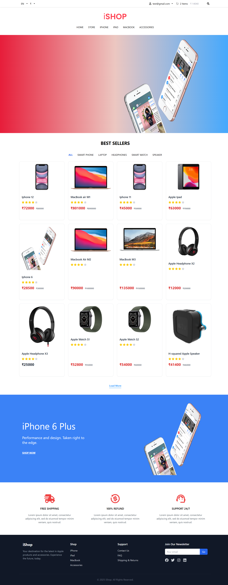
*Homepage showcasing featured products, hero banners, and main navigation menu*

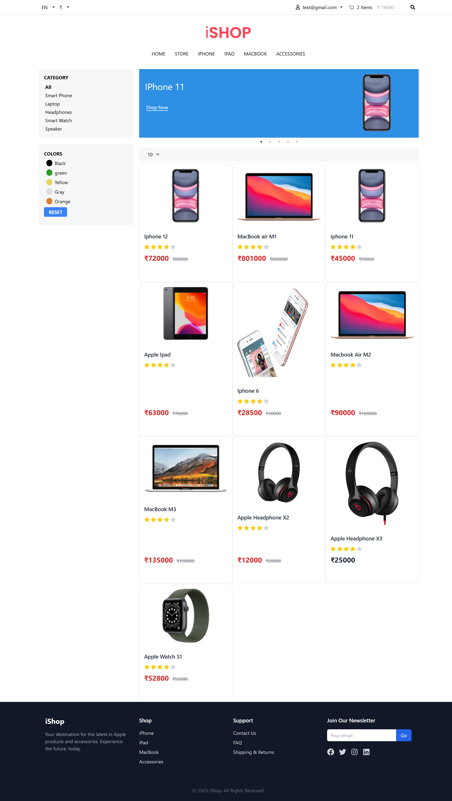
*Complete product catalog with category filters, search functionality, and product grid layout*

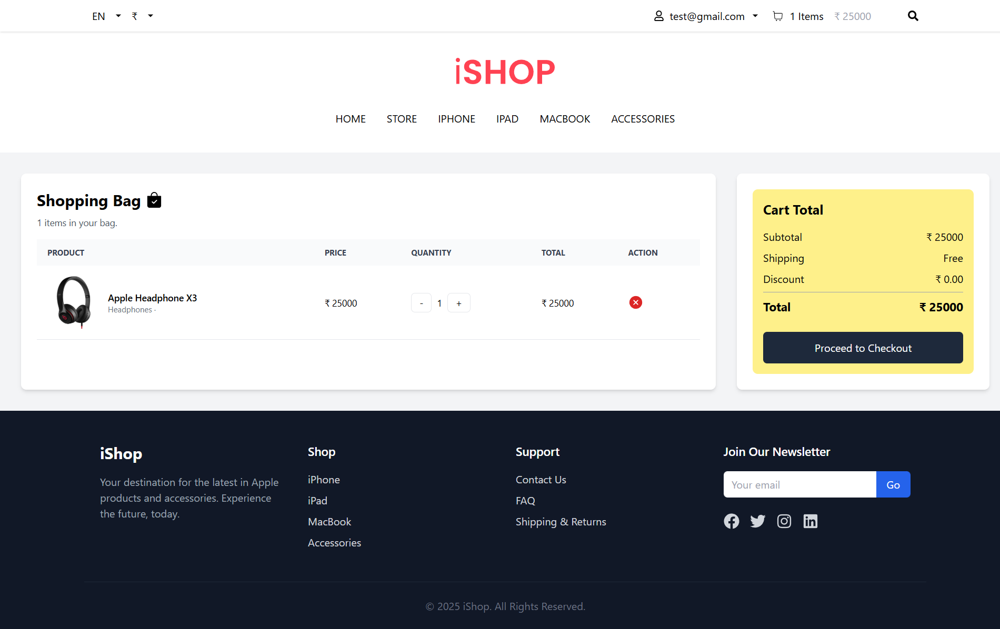
*Interactive shopping cart displaying selected items, quantities, pricing, and cart management options*

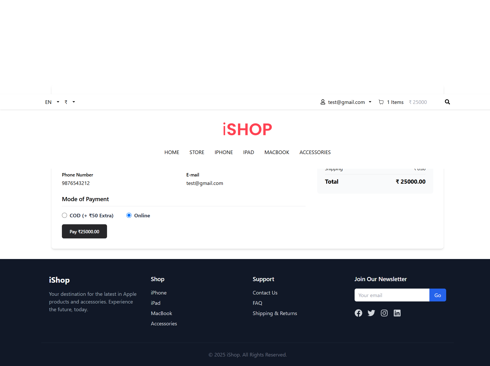
*Secure checkout form with shipping address fields, contact information, and payment method selection*

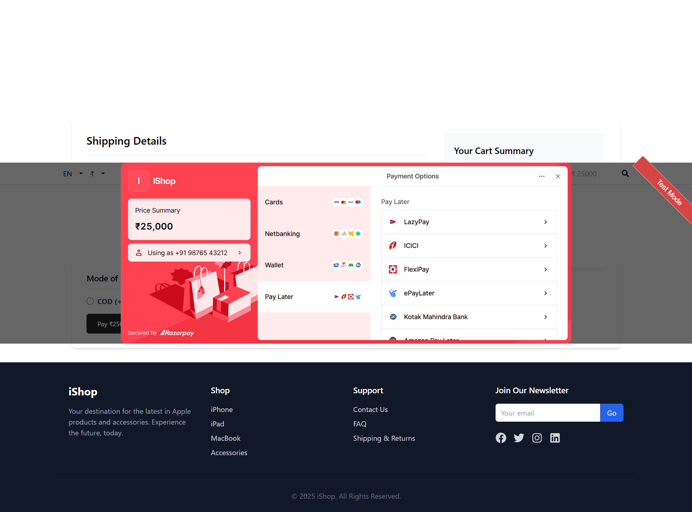
*Integrated Razorpay payment gateway interface for secure online transactions and card processing*

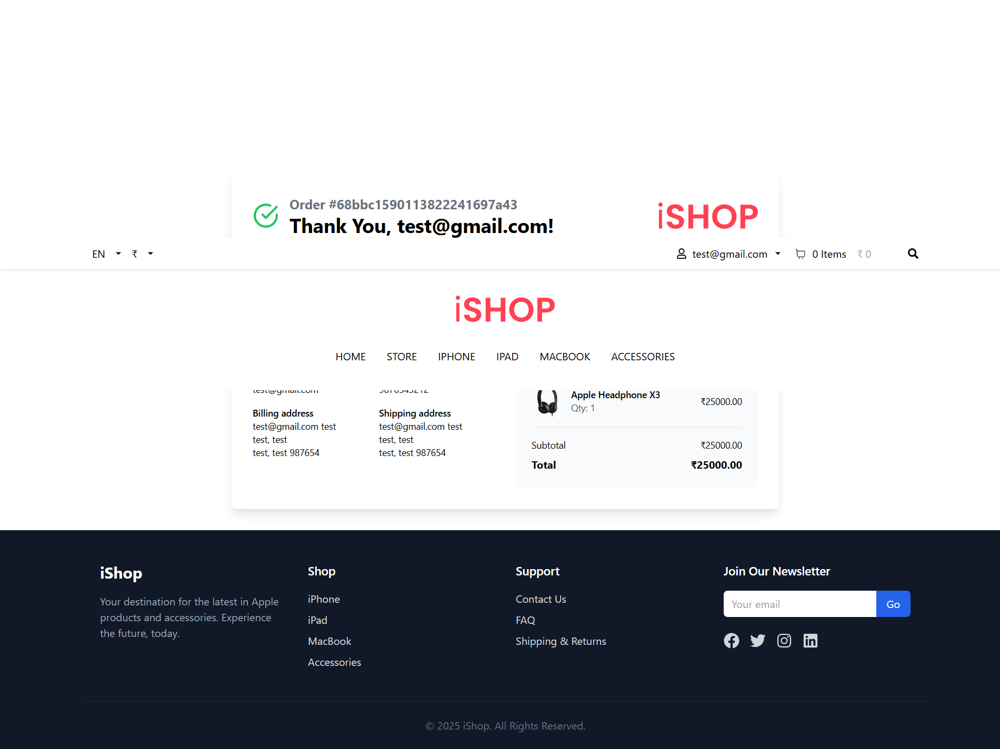
*Order confirmation page displaying successful purchase details, order number, and next steps*

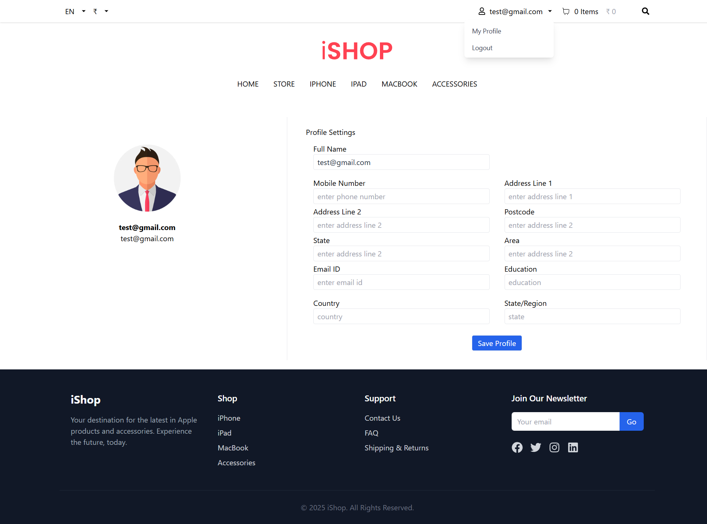
*User profile dashboard with personal information management, order history, and account settings*

### Admin Dashboard

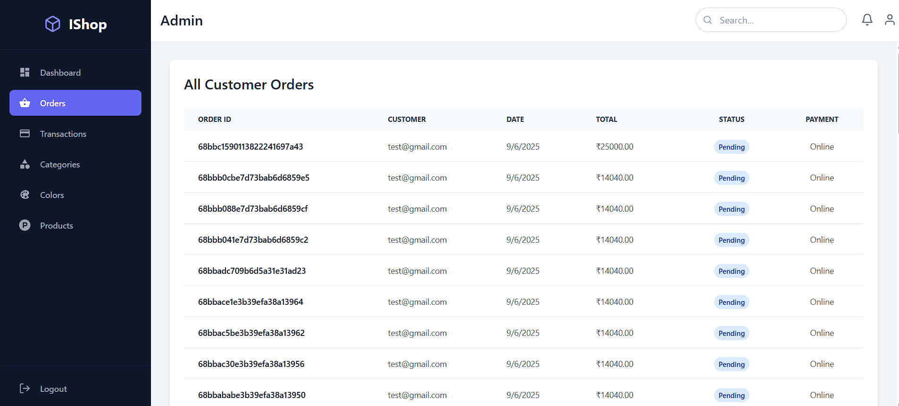
*Comprehensive order management system showing customer orders, status tracking, and order details*

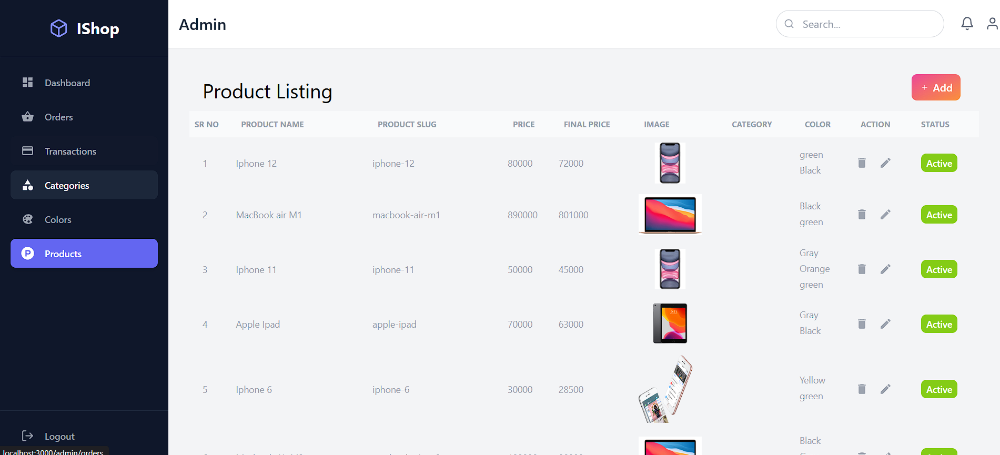
*Product administration interface with CRUD operations, image uploads, pricing, and inventory management*

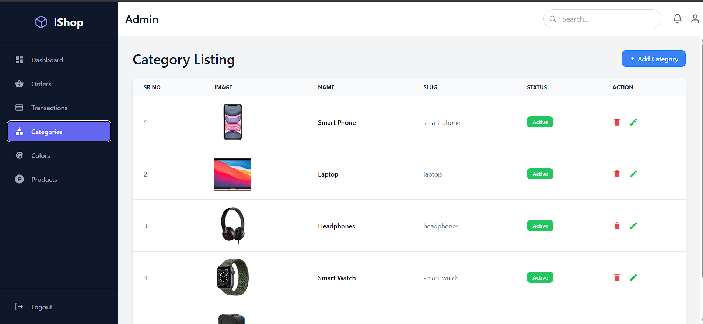
*Category management system for organizing products with hierarchical structure and visual category display*

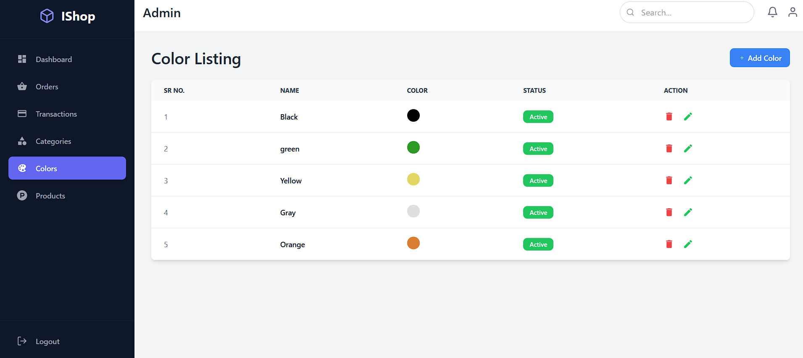
*Color variant management interface for creating and controlling product color options and availability*

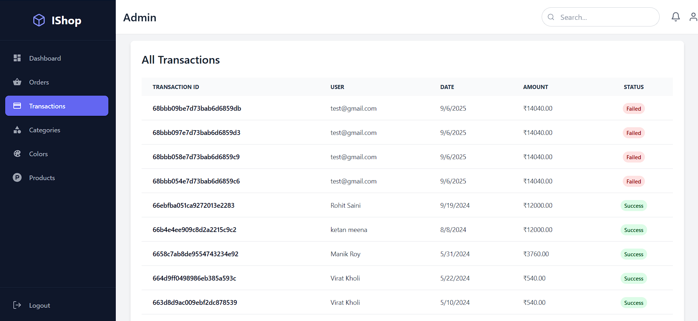
*Payment transaction monitoring dashboard with financial reporting, payment status, and transaction history*

## 🚀 Overview

iShop is a comprehensive e-commerce platform that provides both a customer-facing storefront and a powerful administrative panel. Built with modern technologies, it offers a seamless shopping experience for customers and robust management tools for administrators.

## ✨ Key Features

### 🛒 Customer Features
- **Secure Authentication** - User registration and login system
- **Product Catalog** - Browse products by categories with color filters
- **Smart Shopping Cart** - Add, remove, and update items with persistence
- **Multiple Payment Options** - Cash on Delivery (COD) and Razorpay integration
- **Order Tracking** - Real-time order status updates
- **Responsive Design** - Optimized for all devices

### 👨‍💼 Admin Features
- **Analytics Dashboard** - Revenue tracking, order metrics, and sales charts
- **Order Management** - Complete order lifecycle management
- **Product Management** - Full CRUD operations with image uploads
- **Category & Color Management** - Organize products efficiently
- **Transaction Monitoring** - Payment tracking and reconciliation

## 🛠️ Technology Stack

### Backend
| Technology | Purpose |
|------------|---------|
| Node.js | Runtime environment |
| Express.js | Web framework |
| MongoDB | Database |
| Mongoose | Database modeling |
| Razorpay | Payment processing |
| Express-fileupload | File handling |

### Frontend
| Technology | Purpose |
|------------|---------|
| React.js | UI framework |
| Redux Toolkit | State management |
| Tailwind CSS | Styling |
| React Router | Navigation |
| Axios | API requests |
| Recharts | Data visualization |

## 🚦 Quick Start

### Prerequisites
- Node.js (v14 or higher)
- MongoDB (local or Atlas)
- npm or yarn

### Installation

1. **Clone the repository**
   ```bash
   git clone <your-repository-url>
   cd ishop-ecommerce
   ```

2. **Backend Setup**
   ```bash
   cd backend
   npm install
   ```

3. **Frontend Setup**
   ```bash
   cd frontend
   npm install
   ```

### Configuration

Create a `.env` file in the frontend directory:

```env
# API Configuration
REACT_APP_API_BASE_URL="http://localhost:5000"

# Route Endpoints
REACT_APP_CATEGORY_BASE_URL="/category"
REACT_APP_COLOR_BASE_URL="/color"
REACT_APP_PRODUCT_BASE_URL="/product"
REACT_APP_USER_BASE_URL="/user"
REACT_APP_CART_BASE_URL="/cart"
REACT_APP_ORDER_BASE_URL="/order"
```

> ⚠️ **Important**: MongoDB connection string and Razorpay keys are currently hardcoded. Move these to environment variables for production use.

### Running the Application

1. **Start Backend Server**
   ```bash
   cd backend
   npm start
   ```
   Server runs on: `http://localhost:5000`

2. **Start Frontend Server**
   ```bash
   cd frontend
   npm start
   ```
   Application opens at: `http://localhost:3000`

## 📖 Usage Guide

### For Customers

1. **Browse Products** - Visit `/store` to explore categories and filter by colors
2. **Shopping Cart** - Add items to cart (works for both guests and registered users)
3. **Account Management** - Register or login to save cart and track orders
4. **Checkout Process** - Choose between COD or online payment options
5. **Profile Management** - Access `/my-profile` for account details

### For Administrators

1. **Admin Access** - Navigate to `/admin/login`
2. **Setup Admin Account**:
   - Register as a regular user
   - Change role from 'user' to 'admin' in MongoDB
   - Login with admin credentials
3. **Dashboard Navigation** - Use sidebar to access different management sections
4. **Data Management** - Perform CRUD operations on products, orders, categories, and colors

## 🔧 Project Structure

```
ishop-ecommerce/
├── backend/
│   ├── controllers/
│   ├── models/
│   ├── routers/
│   └── index.js
├── frontend/
│   ├── src/
│   │   ├── components/
│   │   ├── pages/
│   │   ├── redux/
│   │   └── App.js
│   └── public/
└── screenshots/
```

## 🤝 Contributing

1. Fork the repository
2. Create your feature branch (`git checkout -b feature/AmazingFeature`)
3. Commit your changes (`git commit -m 'Add some AmazingFeature'`)
4. Push to the branch (`git push origin feature/AmazingFeature`)
5. Open a Pull Request

## 📝 License

This project is licensed under the MIT License - see the [LICENSE](LICENSE) file for details.

## 🙋‍♂️ Support

For support, email rahulsaini42854@gmail.om or create an issue in this repository.

---

<div align="center">
  <b>Built with ❤️ using React.js and Node.js</b>
</div>